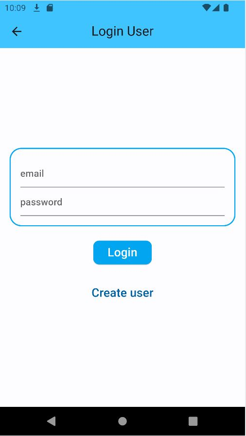
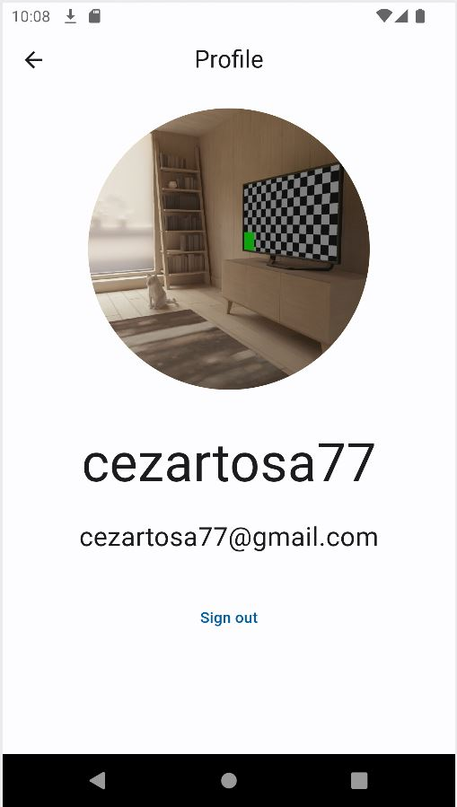
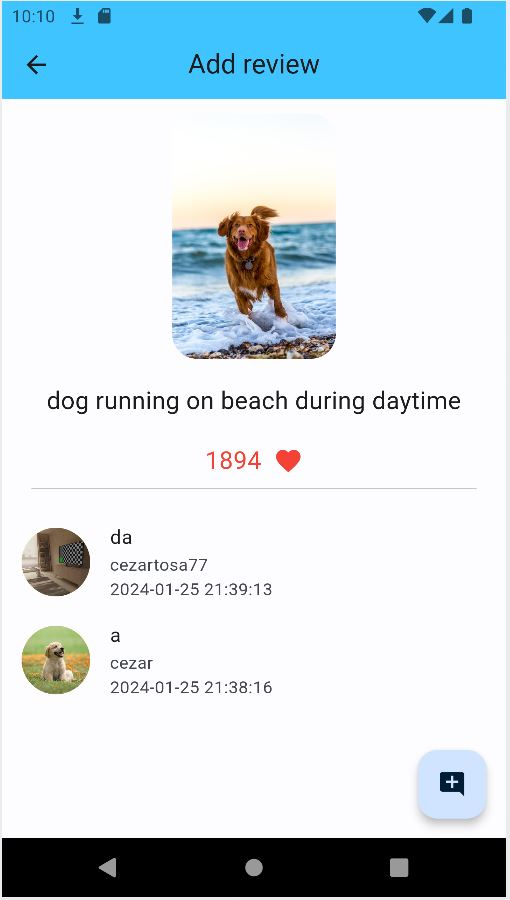
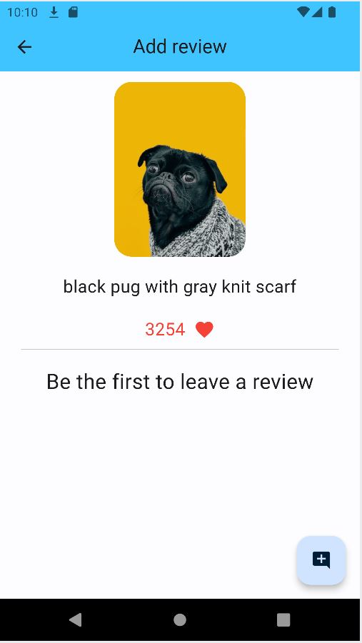

# infinite_scrolling_images

My project for Atelier Digital course

## Features

This project is an infinite scrolling app. You can search for a certain picture, choosing also its
primaries colors.

It has a feature for signing in, where you can create an account for leaving a review of your most
favourite pictures, so that other people can view your reactions.

What it uses:

- [Unsplash: It uses its api for querying the pictures that the user required](https://unsplash.com/)
- [Firebase: For storing all the data linked to registration and reviews management](https://firebase.google.com/)

Some images of the app:

- 
- 
- 
- 
- 
- 
- 
